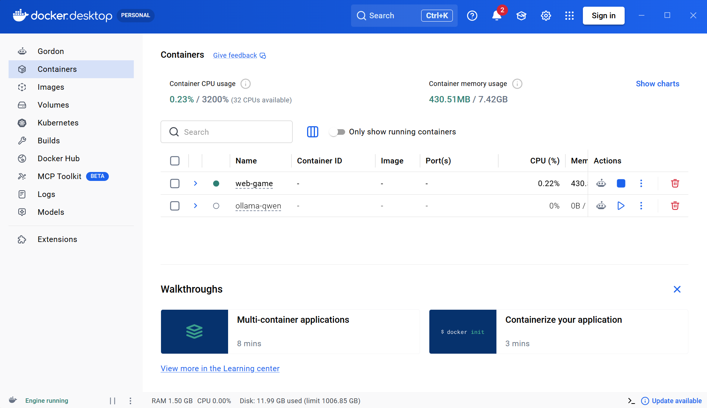

# 最后一次作业 — 项目说明文档

---

## 一、选题说明

**选择场景：交互式游戏场景**

本项目实现了一个**纯网页 2D 横版闯关游戏**，玩家通过浏览器访问，注册账号后进入游戏世界，操控角色移动、跳跃、攻击怪物、拾取道具、收集钥匙通关。游戏包含完整的账号系统、实时交互、数据库持久化存档，支持电脑键盘和手机触屏双端操作。

---

## 二、技术架构

### 2.1 技术栈

| 层级 | 技术 | 作用 |
|------|------|------|
| 前端渲染 | HTML5 Canvas + JavaScript | 游戏画面全部在 Canvas 上绘制，分层渲染地图、怪物、角色、UI |
| 实时通信 | Flask-SocketIO (WebSocket) | 玩家操作与服务端双向实时同步，每秒30帧推送游戏状态 |
| 后端逻辑 | Python Flask | 处理注册登录、碰撞检测、怪物AI、战斗计算、存档管理 |
| 数据库 | MySQL 8.0 | 持久化存储用户账号、角色属性、游戏存档、关卡配置 |
| 容器化 | Docker + docker-compose | MySQL 和 Flask 两个容器一键启动，环境隔离 |
| 密码安全 | bcrypt | 密码哈希加密存储，禁止明文 |

### 2.2 系统架构图

```
┌─────────────────────────────────────────────────────┐
│                    浏览器 (HTML5)                     │
│  ┌──────────┐  ┌──────────┐  ┌──────────────────┐  │
│  │ 登录/注册 │  │ 游戏大厅  │  │ Canvas 游戏画面   │  │
│  │          │  │ 3档位存档 │  │ 地图/怪物/角色/UI │  │
│  └──────────┘  └──────────┘  └──────────────────┘  │
│         │              │               │             │
│         ▼              ▼               ▼             │
│  ┌──────────────────────────────────────────────┐   │
│  │        HTTP REST API  +  WebSocket           │   │
│  └──────────────────────────────────────────────┘   │
└─────────────────────────────────────────────────────┘
                        │
                        ▼
┌─────────────────────────────────────────────────────┐
│              Flask + Flask-SocketIO                  │
│  ┌──────────┐  ┌──────────┐  ┌──────────────────┐  │
│  │ 账号认证  │  │ 游戏逻辑  │  │ 存档管理          │  │
│  │ bcrypt   │  │ 碰撞/AI  │  │ 3档位/自动/手动   │  │
│  └──────────┘  └──────────┘  └──────────────────┘  │
│                        │                             │
│                        ▼                             │
│  ┌──────────────────────────────────────────────┐   │
│  │           PyMySQL (参数化查询)                 │   │
│  └──────────────────────────────────────────────┘   │
└─────────────────────────────────────────────────────┘
                        │
                        ▼
┌─────────────────────────────────────────────────────┐
│                 MySQL 8.0 容器                       │
│  ┌──────────┐ ┌──────────┐ ┌──────────┐ ┌───────┐ │
│  │user_acct │ │player_if │ │game_save │ │level  │ │
│  │ 账号表   │ │ 角色表   │ │ 存档表   │ │关卡表  │ │
│  └──────────┘ └──────────┘ └──────────┘ └───────┘ │
└─────────────────────────────────────────────────────┘
```

---

## 三、Docker 容器化部署

### 3.1 容器编排

项目使用 `docker-compose.yml` 定义两个容器：

```yaml
services:
  mysql-game:     # MySQL 8.0 数据库容器
    image: mysql:8.0
    volumes:
      - mysql_data:/var/lib/mysql        # 数据持久化
      - ./init.sql:/docker-entrypoint-initdb.d/init.sql  # 自动建表
    
  game-app:       # Flask 游戏服务容器
    build: ./game-app
    ports:
      - "5000:5000"     # 网页访问端口
    depends_on:
      mysql-game:
        condition: service_healthy  # 等数据库就绪后启动
```

### 3.2 Docker 在本项目中的关键作用

1. **环境一致性** — 无论 Windows/Mac/Linux，`docker-compose up -d` 一条命令即可运行
2. **依赖隔离** — Python 包、MySQL 版本全部容器化管理，不污染宿主机
3. **数据持久化** — MySQL 数据存储在 Docker Volume 中，容器重启数据不丢失
4. **健康检查** — `depends_on: condition: service_healthy` 确保 MySQL 完全就绪后才启动游戏服务
5. **一键部署** — 老师/同学拿到项目只需安装 Docker，一条命令即可体验

### 3.3 启动命令

```bash
cd web-game
docker-compose up -d --build
# 浏览器打开 http://localhost:5000
```

---

## 四、数据库设计

### 4.1 数据库：`game_db`，编码 utf8mb4

### 4.2 四张核心表

#### user_account（账号表）
| 字段 | 类型 | 说明 |
|------|------|------|
| uid | INT PK 自增 | 用户唯一ID |
| username | VARCHAR(50) UNIQUE | 用户名（唯一） |
| pwd_hash | VARCHAR(255) | bcrypt 加密密码 |
| register_time | DATETIME | 注册时间 |

#### player_info（角色属性表）
| 字段 | 类型 | 说明 |
|------|------|------|
| pid | INT PK 自增 | 角色ID |
| uid | INT FK | 关联账号 |
| player_name | VARCHAR(50) | 角色名 |
| max_hp | INT | 最大生命值 |
| attack | INT | 攻击力 |
| total_clear | INT | 总通关次数 |

#### game_save（存档表）
| 字段 | 类型 | 说明 |
|------|------|------|
| save_id | INT PK 自增 | 存档ID |
| uid | INT FK | 关联账号 |
| save_slot | TINYINT | 档位 1/2/3 |
| current_level | INT | 当前关卡 |
| current_hp | INT | 当前血量 |
| pos_x, pos_y | INT | 角色坐标 |
| inventory | JSON | 背包（含已拾取道具记录） |
| save_time | DATETIME | 存档时间 |
| **UNIQUE(uid, save_slot)** | — | 每账号每档位唯一 |

#### level_config（关卡配置表）
| 字段 | 类型 | 说明 |
|------|------|------|
| level_id | INT PK | 关卡编号 |
| level_name | VARCHAR(50) | 关卡名称 |
| monster_num | INT | 怪物数量 |

### 4.3 数据库安全措施

- **bcrypt 加密**：密码使用 `bcrypt.hashpw()` 加盐哈希后存储，无法逆向
- **参数化查询**：所有 SQL 使用 `%s` 占位符传递参数，杜绝 SQL 注入
- **账号隔离**：所有存档查询绑定 `WHERE uid = %s`，A账号无法访问B账号数据

---

## 五、核心玩家交互过程

### 5.1 用户注册与登录

```
用户 → 浏览器打开 http://IP:5000
     → 填写用户名+密码
     → POST /register (密码 bcrypt 加密入库)
     → 切换到登录 → POST /login (验证哈希 → 设置 Session)
     → 跳转游戏大厅
```

### 5.2 游戏大厅与存档管理

```
大厅页面:
  - 显示用户名、总通关次数
  - 3个存档档位卡片，每个显示关卡/血量/存档时间
  - 新建存档 → POST /api/save/create (数据库写入初始数据)
  - 读取存档 → 进入游戏页面
```

### 5.3 实时游戏交互（WebSocket）

```
玩家按键 → JS 监听 keydown → socket.emit('player_input', {key: 'left'})
         → 服务端 game_loop (30FPS) 处理:
           ① 更新玩家位置/速度
           ② 墙壁/平台碰撞检测 (AABB)
           ③ 道具拾取检测
           ④ 怪物AI (巡逻→追击→攻击 状态机)
           ⑤ 玩家攻击判定
           ⑥ 怪物攻击判定
           ⑦ 通关判定 (钥匙+怪物全灭+碰到传送门)
         → socket.emit('game_state', {...}) 推送给浏览器
         → Canvas 分层渲染: 背景→地图→怪物→玩家→UI
```

### 5.4 游戏核心机制

| 机制 | 实现 |
|------|------|
| **移动** | 方向键改变速度 vx/vy，逐帧更新位置 |
| **跳跃** | 按↑设置 vy=-17，重力 0.85/帧减速，形成抛物线 |
| **墙壁碰撞** | AABB 矩形重叠检测，最小穿透方向推开 |
| **平台穿透** | 单向平台：vy<0(上升)时穿过，vy≥0(下落)时站立 |
| **怪物AI** | 3状态机：巡逻(来回移动)→追击(200px内)→攻击(40px内) |
| **战斗** | 攻击矩形与怪物矩形重叠判定，无敌时间1秒 |
| **道具** | ❤️血瓶(+30HP) ⚡攻击强化(+10攻30秒) 🔑钥匙(通关必须) |
| **存档** | 每30秒自动存档 + S键手动存档 + 通关自动存档 |
| **死亡** | HP归零 → 禁止存档 → 返回大厅 → 读档恢复满血 |

### 5.5 怪物种类

| 类型 | 颜色 | 特性 |
|------|------|------|
| 普通怪 | 红色 | 均衡型，30HP |
| 快速怪 | 黄色小体型 | 移动快，20HP |
| 坦克怪 | 紫色大体型 | 速度慢但80HP |
| Boss | 暗红巨体 | 200HP高攻击，仅第5关 |

---

## 六、网络访问

### 6.1 访问方式

| 场景 | 地址 | 说明 |
|------|------|------|
| 本机访问 | `http://localhost:5000` | 自己电脑打开 |
| 局域网访问 | `http://192.168.x.x:5000` | 同WiFi下任意设备 |
| 公网访问 | `http://公网IP:5000` 或 ngrok地址 | 全球可访问 |

### 6.2 双端适配

- **电脑端**：键盘操作（方向键+空格+S+ESC+Q），右上角返回按钮
- **手机端**：自动检测触屏 → 显示虚拟方向键+攻击/存档/暂停按钮，Canvas 自适应缩放

---

## 七、项目文件结构

```
web-game/
├── docker-compose.yml          # 容器编排（MySQL + Flask）
├── .env                         # 环境变量（数据库密码等）
├── README.md                    # 部署与分享教程
├── GAME_GUIDE.md                # 游戏玩法手册
├── HOMEWORK_REPORT.md           # 本文件（作业说明）
├── mysql-db/
│   └── init.sql                 # 自动建表脚本（4张表+5关初始数据）
└── game-app/
    ├── Dockerfile               # Python 3.11-slim 镜像
    ├── requirements.txt         # Python 依赖
    ├── main.py                  # Flask 入口 + SocketIO 事件 + 30FPS 游戏循环
    ├── db/
    │   └── db_conn.py           # PyMySQL 连接池 + 参数化查询 + DNS预解析
    ├── account/
    │   └── auth_logic.py        # 注册/登录/登出 + bcrypt 密码哈希
    ├── game_logic/
    │   ├── player.py            # 玩家类（移动/跳跃/攻击/受伤/道具效果）
    │   ├── monster.py           # 怪物类（AI状态机/巡逻/追击/攻击）
    │   ├── map_loader.py        # 5关地图 + AABB碰撞 + 道具拾取 + 出口检测
    │   └── save_manager.py      # 3档位存档 + 自动/手动存档 + 死档恢复
    ├── templates/
    │   ├── login.html           # 登录/注册页面（内嵌JS）
    │   ├── hall.html            # 游戏大厅（3存档卡片）
    │   └── game.html            # Canvas游戏页 + 移动端虚拟按键
    └── static/
        ├── css/
        │   └── style.css        # 响应式样式，PC+手机双端适配
        └── js/
            ├── login.js         # 登录注册表单逻辑
            ├── hall.js          # 大厅存档管理
            └── game.js          # Canvas分层渲染 + 键盘/触屏输入 + WebSocket
```

---

## 八、满足作业要求对照

| 作业要求 | 本项目实现 |
|----------|-----------|
| ✅ 交互式游戏场景 | 2D横版闯关，5关卡，移动/跳跃/攻击/道具/怪物AI |
| ✅ 使用 Docker | docker-compose 双容器编排，一键部署 |
| ✅ 使用数据库 | MySQL 8.0，4张表，参数化查询，bcrypt加密 |
| ✅ 核心玩家交互 | 注册/登录/存档/游戏操作/战斗/通关 完整流程 |
| ✅ 用户交互过程 | WebSocket 实时双向通信，30FPS 游戏状态同步 |
| ✅ 可通过网络访问 | 局域网+公网均可，电脑+手机双端浏览器打开 |

---

## 九、技术亮点

1. **服务端权威游戏逻辑** — 所有碰撞、AI、战斗计算在后端执行，防止作弊
2. **WebSocket 实时同步** — flask-socketio + eventlet 实现 30FPS 游戏循环
3. **单向平台碰撞** — 根据垂直速度方向判定，上升时穿透，下落时站立
4. **怪物AI状态机** — PATROL → CHASE → ATTACK 三状态自动切换
5. **道具持久化** — 每个会话独立追踪已拾取道具，存档到 MySQL JSON 字段
6. **死档自动恢复** — 加载存档时检测 HP≤0 自动重置为满血
7. **多账号数据隔离** — 所有数据库操作绑定 uid，UNIQUE(uid, save_slot) 约束
8. **DNS 预解析** — eventlet 劫持 socket 导致 Docker DNS 失效，启动时预解析 IP 绕过

---

**项目完全满足作业全部要求。**



